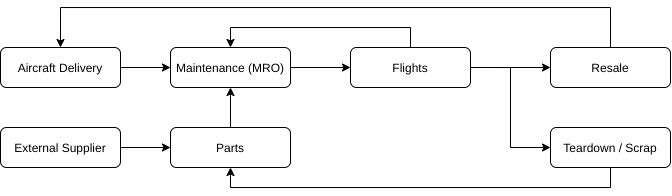
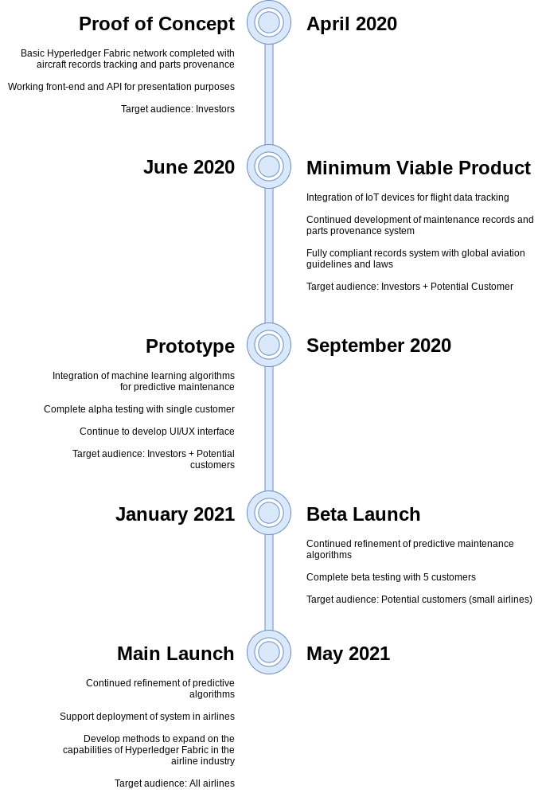
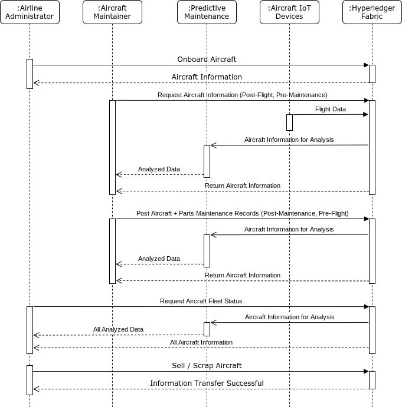

# Hyperledger Fabric + Aircraft MRO

**A Distributed Applications II Project**  
Aaron Lu - 101278524

[Hyperledger Fabric + Aircraft MRO Pitch Presentation](https://docs.google.com/presentation/d/1wEVzxKrAMhcqZpjzRCup2dHBgFmt6gY-MDXYOtnlCzk/edit?usp=sharing)

## Description

The aerospace industry has a vast and complex supply chain involving hundreds to thousands of companies and millions of parts. The entire supply chain must meet specific regulations and procedures specified by governing bodies from governments and other organizations. The many facets of the supply chain can be seen in the various phases of aircraft development and deployment - parts procurement, aircraft assembly, certification, delivery, maintenance, and end-of-life.

This project does not seek to provide a umbrella solution for the entire aerospace supply chain, but instead, a targeted solution for airline companies and the required maintenance, repair, and overhaul (MRO) cycle for purchased aircraft. The goal is to digitize maintenance and parts provenance records in a manner that increases trust when the aircraft is sold, saves money through a more streamlined process, and most importantly, increase the safety of air travel.

The proposed solution hopes to accomplish the most paradoxical problem in supply chain: how to increase reliability, safety, and quality while decreasing cost.

### Background

For a typical airline company like Air Canada, Delta, KLM, etc, an aircraft follows the cycle shown in the figure below:  
  
The aircraft is delivered and the cycle of maintenance and flights occur until it is determined to be sold or scrapped. During MRO procedures, parts can be supplied as brand new from external suppliers or they may be recovered from a scrapped aircraft. These parts are still viable for use because they have not exceeded their flight hours threshold.

The issue is that maintenance records are often still tracked on paper, and the record for an aircraft may be binders full of various pieces of information. Additionally, parts that have been used in other aircraft may not have the correct provenance and be missing critical information regarding their lifespan. Overall, information is more difficult to find and track which puts customers lives at stake, and introduces inefficiencies to very carefully optimized plan of flight schedules.

### Solution Architecture

The proposed solution leverages blockchain technology through Hyperledger Fabric for tracking and sharing information within an airline and with other airlines when an aircraft is to be sold. Maintenance and parts provenance records can be easily stored on the blockchain network by MRO providers through manually updates, and IoT device integration.

Internet of things (IoT) devices allow for flight records to be automatically generated for the aircraft and its associated parts. The devices can track temperature and acceleration to track the various stresses and conditions and note if abnormal conditions were encountered. This information would be stored on the blockchain to provide an immutable record for the history of an aircraft or part.

However, IoT devices often provide massive amounts of information and analyzing the information for dangerous patterns is difficult. In addition to blockchain and IoT technology, the proposed solution would include a machine learning algorithm for predictive maintenance. By accessing the maintenance records and IoT data across multiple aircraft, the algorithm would be able to alert maintainers of possible issues or note-worthy trends in aircraft condition.

### Timeline/Implementation

## Technical Details (PoC)

The section discusses the technical parameters used in the Hyperledger Fabric, the Expresss API, and the React front-end.

### Architecture

**Hyperledger Fabric**  
Blockchain as a backend where information about aircraft and parts can be stored according to the data and parameters specified below. Current implementation uses only a single channel, user, and admin for proof of concept. Future implementations would use different channels, users, admins, and private data storage depending on the scale and number of companies.

**Express API**  
Express.js is used as the API to connect to a cloud-based instance of Hyperledger Fabric. In this case, the instance is based in a Google Cloud virtual machine. Future implementation would include multiple APIs spread across various nodes/clients. Additionally, the cloud-based instance would most likely be shifted from a virtual machine to a cloud-based kubernetes cluster.

**React**  
React is the demonstration front-end for a single login point while in the PoC phase. Additionally, the site should be mobile friendly for maintainers to easily use it on the job without needing a large device. In the future, companies would be able to create their own front-end applications to interface with different API endpoints.

### Modeling

The following diagram shows the 5 different types of interactions for the PoC.

1. Airline adminstrator onboards a new aircraft from manufacturer.
1. Maintainer requests information about the aircraft after a flight and before maintenance.
1. Maintainer submits maintenance information about the aircraft before a flight.
1. Administrator requests information on entire fleet.
1. Administrator sells or scraps the aircraft.

_Note: IoT devices and predictive maintenance are not implemented in PoC_

Additional pieces of modeling can be found in the `documentation` folder:

- [User stories](./documentation/userStories.md)
- [Class diagram](./documentation/classDiagram.png)

### Data/Parameters

_Stored in Hyperledger Fabric_

**Aircraft Object**

| Parameter             | Type                                                                                         | Description                                                                                                                                                                                           |
| --------------------- | -------------------------------------------------------------------------------------------- | ----------------------------------------------------------------------------------------------------------------------------------------------------------------------------------------------------- |
| `description`         | `{string aircraft, string tailNumber}`                                                       | For identifying the specific aircraft                                                                                                                                                                 |
| `maintenanceSchedule` | `[{string type, number lastCompletedDate, number lastCompletedHours, number maxHours}, ...]` | An array that tracks the current status of major maintenance cycles                                                                                                                                   |
| `partsList`           | `[string partID, ...]`                                                                       | An array of parts that are currently on the aircraft                                                                                                                                                  |
| `flightHours`         | `number`                                                                                     | Number tracking total number of flight hours for the aircraft                                                                                                                                         |
| `owner`               | `[{string company, number purchaseDate, number soldDate}, ...]`                              | Array tracking purchase/sell history of aircraft (last entry is current owner)                                                                                                                        |
| `maintainers`         | `[string username, ...]`                                                                     | Array listing maintainers for the aircraft (who has access to update aircraft information)                                                                                                            |
| `maintenanceReports`  | `[{number date, string type, string notes, object partsReplaced}, ...]`                      | Array listing the various maintenance reports, inspections, etc; the `partsReplaced` object is a key value pair where the key is the ID of the replaced part, and the value is the ID of the new part |

**Part Object**

| Parameter      | Type                                                                      | Description                                                                                                        |
| -------------- | ------------------------------------------------------------------------- | ------------------------------------------------------------------------------------------------------------------ |
| `description`  | `{string id, string name}`                                                | Number refers to the general part number, especially for replaceable parts, name is a written out name of the part |
| `totalHours`   | `number`                                                                  | Tracking the total number of flight hours for the part                                                             |
| `maximumHours` | `number`                                                                  | Maximum flight hours for the part                                                                                  |
| `history`      | `[{string tailNumber, number hours, number onDate, number offDate}, ...]` | Array showing history of the part, the last index is the most recent                                               |

**User Object**

| Parameter  | Type                | Description                                                                                          |
| ---------- | ------------------- | ---------------------------------------------------------------------------------------------------- |
| `username` | `string`            | stored username                                                                                      |
| `password` | `string`            | hashed password                                                                                      |
| `type`     | `string`            | Can be `admin` or `maintainer`                                                                       |
| `company`  | `string`            | The company that the user works for                                                                  |
| `aircraft` | `[tailNumber, ...]` | An array of tailNumber that the user has access to maintenance records of the corresponding aircraft |

### Functions

_Functions for managing data and interacting with data from outside Hyperledger_

**Chaincode Functions**

| Function Name        | Input                                                                      | Output              | Restricted                  | Details                                                                                                                                     |
| -------------------- | -------------------------------------------------------------------------- | ------------------- | --------------------------- | ------------------------------------------------------------------------------------------------------------------------------------------- |
| `registerUser`       | string `username`, string `password`, string `type`, string `company`      | bool `success`      | Admin + Maintainer          | Creates a user profile for the admin or maintainer, hashed username and password are stored in blockchain, fails if username already exists |
| `checkUser`          | string `username`, string `password`, string `type`, string `company`      | object `user`       | Admin + Maintainer          | Checks the username and password against blockchain information, and returns a boolean                                                      |
| `registerAircraft`   | string `aircraft`, string `tailNumber`, string `company`                   | string `tailNumber` | Admin                       | Register a new aircraft and create the aircraft object                                                                                      |
| `assignAircraft`     | string `username`, string `tailNumber`, string `company`                   | bool `success`      | Admin                       | Assign the maintainer to the aircraft so they have access to the data                                                                       |
| `getAircraft`        | string `tailNumber`                                                        | object `aircraft`   | Admin + Assigned Maintainer | Gets all of the information for a specific aircraft in the format described above                                                           |
| `newPart`            | object `part`                                                              | string `partID`     | Maintainer                  | Register new part in system                                                                                                                 |
| `getPart`            | string `partID`                                                            | object `part`       | Admin + Assigned Maintainer | Gets all of the information for a specific part in the format described above                                                               |
| `updateFlightHours`  | string `tailNumber`, number `hours`                                        | number `hours`      | Assigned Maintainer         | Updates the flight hours for the aircraft and its associated parts (in the future this will be called by IoT devices)                       |
| `performMaintenance` | string `tailNumber`, string `type`, string `notes`, object `replacedParts` | object `aircraft`   | Assigned Maintainer         | Stores the maintenance record for the specified aircraft                                                                                    |
| `replaceParts`       | string `tailNumber`, object `replacedParts`                                | bool `success`      | Assigned Maintainer         | Updates the aircraft and part objects, if new part is entered it creates a new entry                                                        |
| `sellAircraft`       | string `tailNumber`, string `company`                                      | bool `success`      | Admin                       | Transfers ownership of aircraft to new account, and removes maintainers access                                                              |
| `getMaintainers`     | string `company`                                                           | array `maintainers` | Admin                       | Returns a list of all maintainers for a specific company                                                                                    |
| `getCompanies`       |                                                                            | array `companies`   | Admin + Maintainer          | Returns a list of all companies                                                                                                             |

**API Endpoints**

| Endpoint                                       | Type  | Chaincode Function                    | Returns               |
| ---------------------------------------------- | ----- | ------------------------------------- | --------------------- |
| `\` | GET | `getCompanies` | array `companies` |
| `\login`                                       | POST  | `registerUser`                        | bool `success`        |
| `\login`                                       | POST  | `checkUser`                           | string `jsonwebtoken` |
| `\aircraft`                                    | POST  | `registerAircraft`                    | object `aircraft`     |
| `\aircraft`                                    | GET   | `getAircraft`                         | object `aircraft`     |
| `\aircraft`                                    | PATCH | `performMaintenance` + `replaceParts` | object `aircraft`     |
| `\part`                                        | GET   | `getPart`                             | object `part`         |
| `\part`                                        | POST  | `newPart`                             | string `partID`       |
| `\flight`                                      | POST  | `updateFlightHours`                   | number `hours`        |
| `\admin`                                       | POST  | `assignAircraft`                      | bool `success`        |
| `\admin`                                       | PATCH | `sellAircraft`                        | bool `success`        |
| `\admin`                                       | GET   | `getMaintainers`                      | array `maintainers`   |

## Goals + Tasks

- [x] Hyperledger Fabric (maintenance schedule + parts provenance)
  - [x] Complete logic
  - [x] Storing more parameters - if necessary
- [x] Express API
  - [x] basic API
  - [x] user validation using JWT
- [ ] React front-end
  - [x] Basic framework
  - [x] Mobile friendly site
  - [x] Status indicator for front-end on connecting to API (see if it's still active)
  - [ ] Administrator interactions
  - [ ] Maintainer interactions
  - [ ] Full system test using front-end only
- [x] ~~Test cases for chaincode & API~~ _(too difficult for PoC)_
- [x] CI/CD
  - [x] for site deployment
  - [ ] ~~for test cases~~ _(too difficult for PoC)_

## Notes

- Validation with JSON web tokens is not a good security practice. JWT was used for ease of implementation for PoC.

## Resources

- [Maintenance record standards](https://www.icao.int/safety/airnavigation/OPS/airworthiness/Pages/EAMR.aspx)
- [Maintenance checks](https://en.wikipedia.org/wiki/Aircraft_maintenance_checks)
- [Installation instructions for Hyperledger](./documentation/chaincodeInstallation.md)
- [Sample chaincode calls](./chaincode/javascript/commands.md)
- [Github pages + React](https://github.com/gitname/react-gh-pages)
- [Persistent server - nohup yarn start &](https://stackoverflow.com/questions/4018154/how-do-i-run-a-node-js-app-as-a-background-service)
